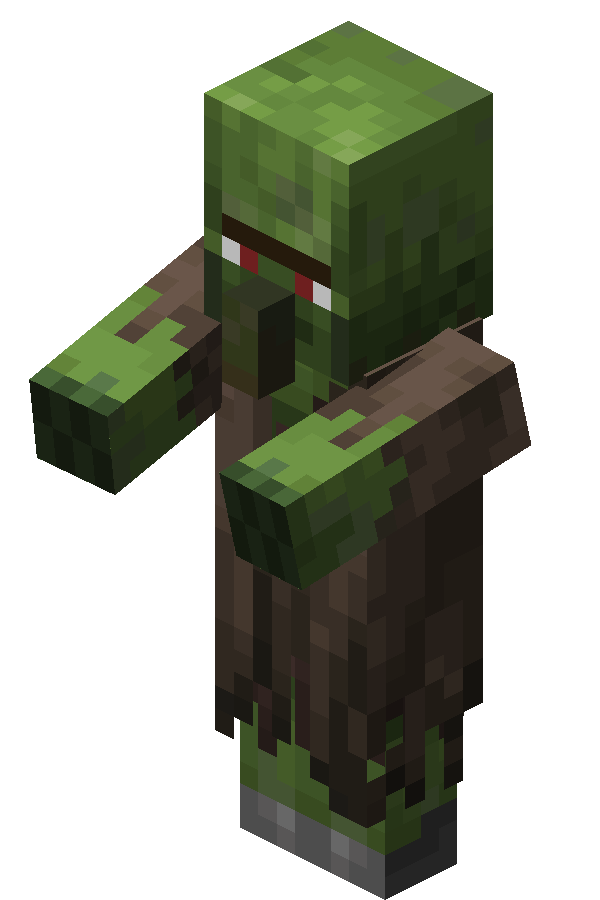
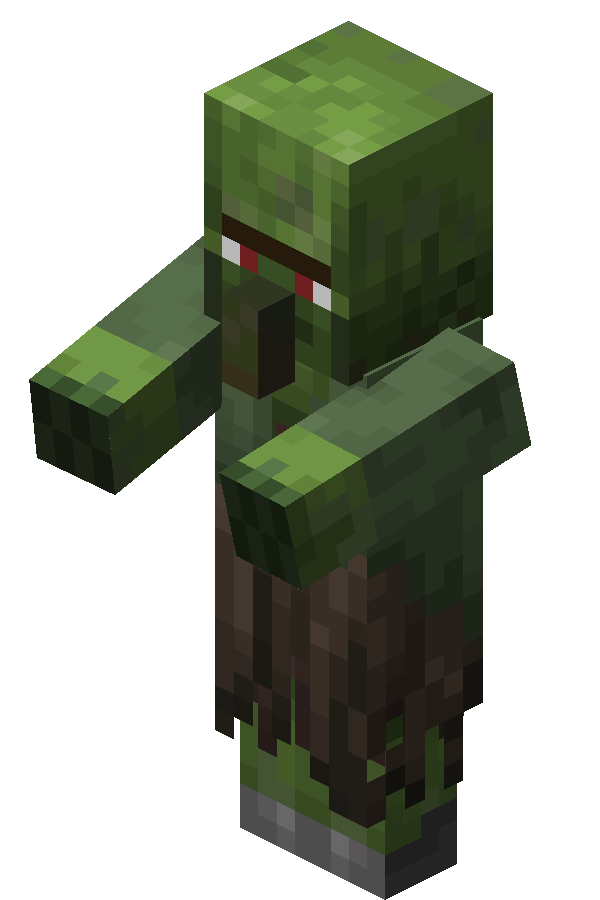
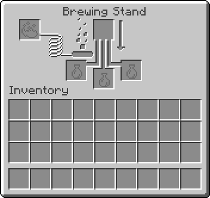
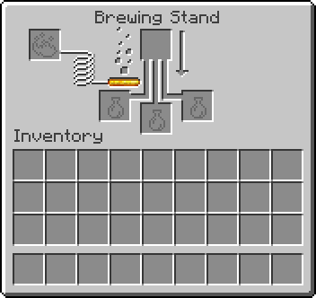

# Hero of the Villagers

## Minecraft Data Pack by TacoSocks

This simple data pack changes up interaction with villagers in the early game. With all natural villager spawns in villages being replaced with zombie villagers, the player must cure every villager of their zombified state in order to take advantage of trading.

*HINT*: The village church might assist you in this endeavor...

You won't just become the hero of the village, but the **hero of *ALL* the villagers**!

---

## Version Compatibility

| Minecraft Version | Available? |
|:---:|:---:|
| `1.21` - `1.21.1` | Yes |
| pre-`1.21` | No, but maybe in future |

---

## Technical Details

Two aspects of vanilla villages have been modified:

- Villager spawns within vanilla village structures are replaced with zombie counterpart (nitwits and unemployed villagers respectively)
- Brewing stands in vanilla village temples (churches) generate with max fuel, removing the need for blaze powder in order to start brewing potions of weakness.

### Villagers to Zombie Villagers

| Without Data Pack | Description | With Data Pack |
|:---:|:---:|:---:|
|  | `Villagers` become `Zombie Villagers` |  |
|  | `Nitwits` become `Zombie Nitwits` |  |

### Pre-filled Brewing Stands

| Without Data Pack | Description | With Data Pack |
|:---:|:---:|:---:|
|  | Village `Brewing Stands` now generate with `20` (max) charges |  |

---

## About

### Creator: `TacoSocks21`

- [YouTube](https://www.youtube.com/@TacoSocks21)

### Inspiration and References

- Images
    - [Villager](https://minecraft.wiki/w/Villager), [Zombie Villager](https://minecraft.wiki/w/Zombie_Villager), and [Brewing Stand](https://minecraft.wiki/w/Brewing_Stand) images came from Minecraft Wiki
